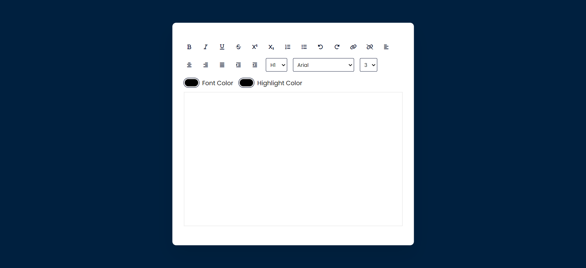

# EasyTextEditor

EasyTextEditor is a simple and lightweight text editor built with HTML, CSS, and JavaScript. Whether you need to take quick notes, edit code snippets, or jot down thoughts, EasyTextEditor provides a seamless and intuitive user experience.



## Features

- **Minimalist Interface:** Focus on your content with a clean and clutter-free design.
- **Rich Text Editing:** Customize your text with basic formatting options such as bold, italic, and underline.
- **Syntax Highlighting:** Ideal for developers, EasyTextEditor offers syntax highlighting for various programming languages.
- **Fast and Responsive:** Enjoy a smooth and responsive text editing experience, even for larger documents.
- **Customizable:** Tailor the editor to your preferences with customizable themes and font settings.

## Getting Started

To use EasyTextEditor, simply open the `index.html` file in your preferred web browser. No installation is required.

```bash
# Clone the repository
git clone https://github.com/your-username/EasyTextEditor.git

# Navigate to the project directory
cd EasyTextEditor
```

## Usage

1. Open the `index.html` file in your web browser.
2. Start typing and enjoy the simplicity of EasyTextEditor.

## Contributing

Contributions are welcome! If you find any issues or have suggestions for improvement, feel free to open an issue or submit a pull request.

## License

This project is licensed under the MIT License - see the [LICENSE](LICENSE) file for details.
